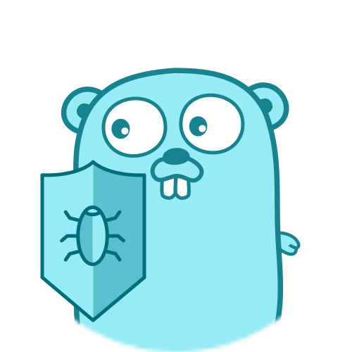

# It's time to Go

#### Jorge Fuertes Alfranca

<p style="font-size: .6em">
    <a href="mailto:jorge1.fuertes@volkswagen-groupservices.com">jorge1.fuertes@volkswagen-groupservices.com</a>
</p>


---

# ¿Qué vamos a ver?

- Historia de Go
- Características Fundamentales
- Fortalezas y Ventajas
- Go vs Lenguajes Interpretados
- Go vs Java
- Backend y APIs
- Microservicios y Cloud
- Conclusiones

---

## Sección 1

# Historia de Go

---

## El Nacimiento de Go

Creado por **Google** en 2009

**Principales creadores:**

- Rob Pike
- Ken Thompson
- Robert Griesemer
- Jorge Fuertes :)

---

## ¿Por qué era necesario?

#### Estado del arte:

<div class="lang" style="font-size: 0.65em;">

|                                           | Lenguaje   | Debilidades                                                                                 |
| ----------------------------------------- | ---------- | ------------------------------------------------------------------------------------------- |
|        | **C++**    | Rápido, pero compilación lenta y alta complejidad.                                          |
|     | **C#**     | Lenguaje complicado, atado a un proveedor.                                                  |
|      | **Java**   | Seguro, pero lento, pesado, y con un ecosistema altamente complejo.                         |
|  | **Python** | Fácil, pero débilmente tipado.                                                              |
|        | **PHP**    | Fácil pero inseguro, tipado blando y se presta a hacer código sucio como el spaghetti code. |
|      | **Ruby**   | Lento, ecosistema complejo, tipado blando. Complejo de testear.                             |

</div>

<p style="font-size: .5em">Muchos de estos lenguajes además necesitan máquinas virtuales, servidores HTTP...</p>

#### Go soluciona todos los problemas

---



## Go al rescate

✅ Compilación rápida (segundos)

✅ Tipado estático fuerte

✅ Sintaxis simple

✅ Concurrencia nativa

✅ Canales nativos

✅ Interfaces implícitas

✅ Rendimiento listo para producción

---

## Rápida adopción en la industria

| Proyecto                    | Rol              |
| --------------------------- | ---------------- |
| Docker                      | Containerización |
| Kubernetes                  | Orquestación     |
| Prometheus, Grafana         | Monitoreo        |
| Go-Ethereum, CosmoSDK, btcd | Blockchain       |

---

## Sección 2

# Características Fundamentales

---

## Tipado Estático Fuerte

```go
var name string = "Go"
var version int = 1

// Error en compilación y en el IDE gracias a gopls:
var invalid string = 123
```

> 🚨 Errores detectados tempranamente

---

## Compilación Rápida

```bash
# Go
go build -o myapp    # ~1 segundo

# C++
g++ myapp.cpp        # ~30 segundos

# Java
javac MyApp.java     # ~10 segundos
```

### Arranque rápido

> 🐢 Algunos servidores desarrollados en Java pueden tardar minutos en arrancar.

---

## Concurrencia

### Goroutines

```go
for i := 0; i < 10000; i++ {
    go func(id int) {
        processWork(id)
    }(i)
}
```

> **Go:** 1000s goroutines en un sólo hilo.
> **Java:** 1 hilo por rutina con todo el overhead.

---

## Gestión de Memoria

```go
type User struct {
    Name string
    Age  int
}

user := &User{"Alice", 30}
// Garbage collection automático y muy rápido
```

---

## Manejo de Errores

```go
file, err := os.Open("data.txt")
if err != nil {
    return fmt.Errorf("failed: %w", err)
}

// ...

return nil
```

- Errores visibles, no ocultos.
- Los errores escalan por el stack gracias a los `return` hasta que es necesario ocuparse de ellos (patada hacia arriba).

---

## Sección 3

# Fortalezas de Go

---

## 🚀 Rendimiento

Procesar 1,000,000 de registros:

```plain
Go      → 2 segundos
Node.js → 15 segundos
Python  → 45 segundos
```

Go es 20x más rápido

---

## ⚡ Velocidad de Compilación

```plain
Go    → 1-2 segundos
Rust  → 5-10 segundos
Java  → 20-30 segundos
C++   → 60+ segundos
```

---

## 📦 Binarios Pequeños

```plain
Go   → 12MB (todo incluido)
Java → 600MB (app + JVM)
```

> Go es 50x más pequeño.

---

## 📚 Standard Library

- `net/http` - Servidor web
- `encoding/json` - JSON
- `crypto/*` - Criptografía
- `database/sql` - Bases de datos
- `testing` - Testing integrado

---

## 🛠️ Tooling Integrado

```bash
go fmt    # Formateo
go test   # Testing
go build  # Compilación
go vet    # Análisis estático
go doc    # Documentación
```

Cero configuración

---

## Sección 4

## Go vs Lenguajes Interpretados

---

## Impacto en Costos

Servir 1M requests/día:

**Python:**

- $10,000/mes
- 20+ instancias

**Go:**

- $500/mes
- 1-2 instancias

Ahorro: 95%

---

## Tipado: Compilación vs Runtime

Python (error en ejecución):

```python
def add(a, b):
    return a + b

result = add("10.5", 5)  # Error aquí
```

Go (error en edición y en compilación):

```go
func Add(a float64, b float64) float64 {
    return a + float64(b)
}

result := Add("10.5", 5)  // Error detectado
```

---

## Escalabilidad

**Python/Node.js:**

```plain
# Necesita load balancer
1 proceso →  1 core
16 cores  → 16 procesos
```

**Go:**

```plain
# Escalado automático
1 proceso → Todos los cores
Goroutines → Espacio de usuario
```

---

## Deployment: Docker

Python (800MB):

```dockerfile
FROM python:3.11
RUN pip install -r requirements.txt
COPY app /app
ENTRYPOINT ["python", "app.py"]
```

Go (12MB):

```dockerfile
FROM scratch
COPY myapp /
ENTRYPOINT ["/myapp"]
```

---

## Sección 5

# Go vs Java

---

## Comparativa

| Aspecto      | Go         | Java    |
| ------------ | ---------- | ------- |
| Sintaxis     | Simple     | Verbosa |
| Compilación  | 1s         | 20s     |
| Startup      | 100ms      | 1s+     |
| Memoria      | 20MB       | 200MB   |
| Concurrencia | Goroutines | Threads |

---

## Reducción de Código

Java (25+ líneas):

```java
public class User {
    private String name;
    private int age;

    public User(String name, int age) {
        this.name = name;
        this.age = age;
    }

    public String getName() { return name; }
    public void setName(String name) { this.name = name; }
}
```

Go (3 líneas):

```go
type User struct {
    Name string
    Age  int
}
```

---

## Concurrencia

Java:

```java
ExecutorService executor =
    Executors.newFixedThreadPool(10);
for (int i = 0; i < 1000; i++) {
    executor.submit(new Worker());
}
```

Go:

```go
for i := 0; i < 1000; i++ {
    go Worker(i)
}
```

---

## Consumo de Recursos

### Crear 10,000 workers

| Lenguage | Footprint.     |
| -------- | -------------- |
| Go       | 100ms, +50MB   |
| Java     | 2000ms, +500MB |

> 🚅 Go escala 10x mejor

---

## Sección 6

# Backend y APIs

---

## Servidor HTTP (10 líneas)

```go
package main

import (
    "fmt"
    "net/http"
)

func main() {
    http.HandleFunc("/", func(w http.ResponseWriter, r *http.Request) {
        fmt.Fprintf(w, "Hello!")
    })
    http.ListenAndServe(":8080", nil)
}
```

> 🏎️ Listo para producción

---

## API REST con Fiber

```go
package main
import "github.com/gofiber/fiber/v2"

type User struct {
    ID   int    `json:"id"`
    Name string `json:"name"`
}

func main() {
    app := fiber.New()
    app.Get("/users/:id", getUser)
    app.Post("/users", createUser)
    app.Listen(":8080")
}
```

---

## Frameworks

| Framework | Estilo                               |
| --------- | ------------------------------------ |
| net/http  | Minimalista                          |
| Gin       | Express-like                         |
| Echo      | Ligero                               |
| Fiber     | Rápido, Express compatible, FastHTTP |

---

## Manejo de Carga

```go
func handleClient(conn net.Conn) {
    defer conn.Close()
    scanner := bufio.NewScanner(conn)
    for scanner.Scan() {
        request := scanner.Text()
        conn.Write([]byte(process(request)))
    }
}

func main() {
    listener, _ := net.Listen("tcp", ":8080")
    for {
        conn, _ := listener.Accept()
        go handleClient(conn)
    }
}
```

10,000+ conexiones simultáneas

---

## gRPC

```go
service UserService {
    rpc GetUser(UserId) returns (User);
    rpc CreateUser(User) returns (User);
}
```

- 10x más rápido que JSON
- Tipado fuerte
- HTTP/2 + multiplexing

---

## Sección 7

# Microservicios y Cloud

---

## ¿Por qué Go?

✅ Binarios pequeños (~10MB)

✅ Bajo overhead (~20MB RAM)

✅ Startup rápido (~100ms)

✅ Concurrencia nativa

✅ Cloud-ready

---

## Dockerfile Optimizado

Go (10MB):

```dockerfile
FROM golang:1.21 as builder
WORKDIR /app
COPY . .
RUN go build -o service

FROM scratch
COPY --from=builder /app/service /
ENTRYPOINT ["/service"]
```

---

## Kubernetes

```yaml
apiVersion: apps/v1
kind: Deployment
metadata:
  name: go-service
spec:
  replicas: 3
  template:
    spec:
      containers:
        - name: go-service
          image: company/go-service:v1
          resources:
            requests:
              memory: "64Mi"
              cpu: "250m"
```

---

## Proyectos Líderes

- **Docker** - Containerización
- **Kubernetes** - Orquestación
- **Prometheus** - Monitoreo
- **Etcd** - Base de datos distribuida
- **gRPC** - Framework de comunicación
- **Consul** - Service discovery

---

## Sección 8

# Conclusiones

---

## Cuándo Usar Go

✅ Backends y APIs

✅ Microservicios

✅ Servicios Cloud

✅ Herramientas CLI

✅ DevOps Tools

✅ Sistemas concurrentes

> Pero no solo eso: Microcontroladores, juegos, aplicaciones CLI y Desktop...

---

## Cuándo NO Usar Go

❓ Web Frontend (usa JavaScript)

❓ Data Science (usa Python)

❓ Mobile nativo (usa Swift/Kotlin)

❓ Scripting rápido (usa Bash)

> Aunque todo es posible...

---

## La Fórmula de Go

```plain
Simplicidad
    +
Rendimiento
    +
Escalabilidad
    =
El Mejor Lenguaje para Backend
```

---

## Por qué Go Gana

1. **Simplicidad** - Más simple para sistemas distribuidos
2. **Cloud** - Cloud-native por diseño
3. **Costes** - Escala con menos recursos
4. **Realimentación** - Compilación rápida
5. **Comunidad** - Uber, Dropbox, Netflix

---

## Recursos

- **Oficiales:**
  - tour.golang.org
  - golang.org/doc

- **Comunidad:**
  - GopherCon
  - Go Community - Slack, Reddit, Discord
  - awesome-go

---

## Tu Roadmap

- **Semana 1:**
  - tour.golang.org
  - hello world
- **Semana 2-3:**
  - API REST simple
  - GoFiber, Gin o Echo
- **Semana 4+:**
  - Proyecto real
  - Open Source

---

## ¡Gracias por tu paciencia e interés!

```go
if ready {
    go makeGreatBackend()
}
```


